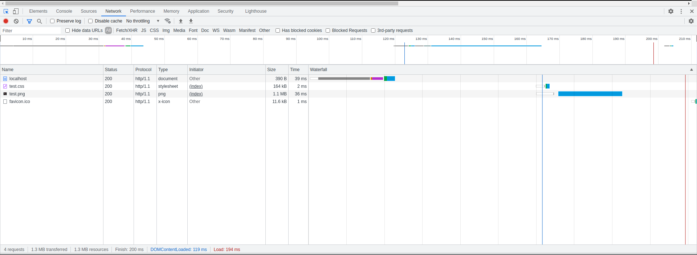
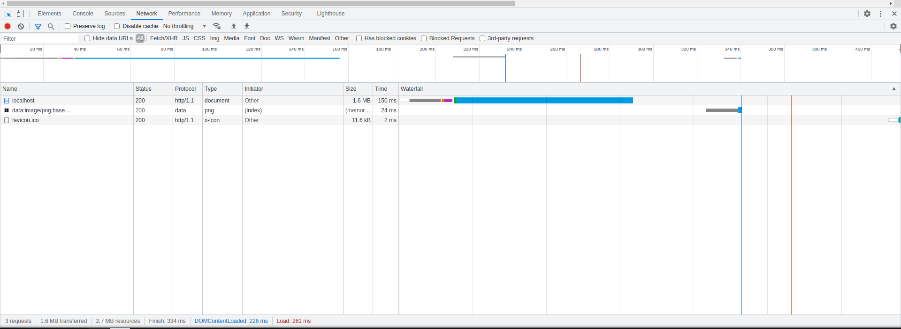
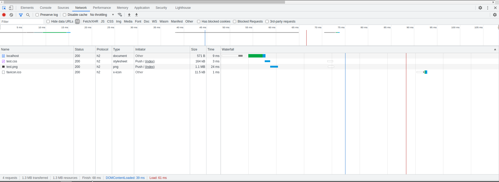

# A comparison between different versions of HTTP

## Prerequisite

You need the following packages installed to be able to replicate what i have done.
- docker
- nginx docker image
- make
- openssl

## How to run

Run this for help
```bash
$ make help
```
As you can see you have to set some variables to run different questions. But before anything you need generage a certificate to be able to run.

To generate a certificate run

```bash
$ make cert
```

For example to run question 2 which is the usage of inline style and data urls you have to run

```bash
$ Q=q2 make run
```

You can change the port as well like this

```bash
$ Q=q2 PORT=4444 make run
```

After running the app, open a browser and go to `https://localhost:PORT`

## Observations

- HTTP/1.1 with seperate style and image file. `plt: 194ms`



- HTTP/1.1 with inline style and data url. `plt: 261ms`



- HTTP/2 with seperate style and image file that are being pushed. `plt: 61ms`



We can see that the first part is preforming better than the second part. I think the reason is that with the first part we get the page much faster since it doesn't have a huge base64 encoded image inside of it and then we can get the two files with two tcp connections. And the overal data transfered is higher in the second part resulting in worse perfomance than the first part. The third part with HTTP2 is perfoming much better that the other 2. The reason is that we are using the server push feature. So the moment that a client sends a `GET` request for `index.html` the server send the required files as well which is resulting much faster load time. We have to keep in mind that this server is running local and the page is not a real world example of a website. I think based on these in real world HTTP2 would perform much better if you ignore TCP retransmit.

## Notes

- All the files for each questions are located in their own directory. For example nginx config for first question is here `config/q1/default.conf` and the static files are located in `static/q2/`.
- For HTTP/2 I needed to run TLS so i did for all of them.
